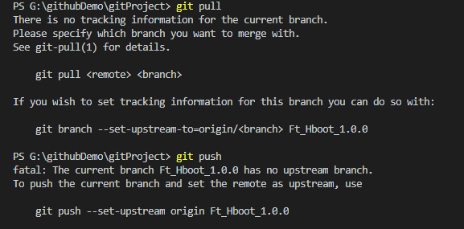

> 记录一下git 常用命令，以及相关应用场景解决方案

### 基础命令

```sh
// 配置本地账户信息
$> git config --global user.name '[name]'
$> git config --gloabl user.email '[email]'

// 初始化项目
$> git init              // 本地初始化一个git 项目
$> git clone [url]          // 克隆一个远程仓库，比如GitHub
$> git remote add origin [url]      // 关联到一个远程仓库 

// 更改保存
$> git add              // 将所有的改动计入暂存区
$> git commit -m '[desc msg]'       // 将所有更改加入版本历史，并说明
$> git pull             // 存远程分支拉取更改
$> git push                  // 将本地更改提交到远程仓库

// 分支管理
$> git branch [name]         // 创建一个分支
$> git checkout [branch-name]      // 切换到另一个分支
$> git merge [branch-name]             // 合并指定分支到当前分支上
$> git branch -d [branch-name]            // 删除一个指定分支
```


### 应用场景

在日常工作中，经常会遇到的问题记录。

#### 忽略不需要版本记录的资源

创建`.gitignore` 文件，

```sh
// win 环境下创建文件

$> echo "">>.gitignore
```
示例为`react`项目中`.gitignore`文件
```.gitignore
# dependencies
/node_modules
/.pnp
.pnp.js

# testing
/coverage

# production
/build

# misc
.DS_Store
.env.local
.env.development.local
.env.test.local
.env.production.local

npm-debug.log*
yarn-debug.log*
yarn-error.log*

```

#### 关联远程仓库

关联远程仓库，有两种情况：

手动创建一个GitHub远程仓库。

1. 本地初始化后远程关联

    ```shell
    $> git init

    // 远程仓库创建完成后，进行关联
    $> git remote add origin git@github.com:ngd-b/Git-Project.git
    // 关联后，切换到远程的分支
    $> git checkout main
    ```
    现在GitHub上新建的主分支改为main，不是master

2. 克隆一个远程的仓库
    ```sh
    $> git clone git@github.com:ngd-b/Git-Project.git
    ```

#### 关联远程分支

正常如果是直接克隆或者关联到了远程仓库，从远程拉取对应的分支即可。

1. 拉取远程分支到本地

    拉取分支时，保证本地仓库与远程时同步。即通过`git pull`

    然后查看远程仓库有哪些分支，`git branch -a ` ; 分支`Ft_Hboot_1.1.0` 是在github上手动创建的。

    ```sh
    $> git pull

    $> git branch -a 

    $> git checkout -b Ft_Hboot_1.1.0 origin/Ft_Hboot_1.1.0 
    ```
    现在建立了连接，可通过`git pull`或`git push` 测试。

    新建`second.txt` 编辑并提交

    ```sh
    $> echo 'git checkout -b Ft_Hboot_1.1.0 origin/Ft_Hboot_1.1.0'>>second.txt

    $> git add -A
    $> git commit -m 'add second.txt'
    $> git push
    ```

    > 默认创建的本地分支和远程分支保持名称相同。

2. 关联本地分支到远程分支 - 远程分支时

    本地创建一个分支，切换到新建分支；新增文件`first.txt`,保存本提交到该分支。

    ```sh
    $> git branch Ft_Hboot_1.0.0              
    $> git checkout Ft_Hboot_1.0.0

    $> git add -A
    $> git commit -m 'feat:add first.txt'
    
    $> git pull
    ```
    直接操作`git pull`或`git push` 时，提示错误

    

    这里解决就有两个方面，一是如果远程没有此分支,按照`git push` 提示
    ```sh
    $> git push --set-upstream origin Ft_Hboot_1.0.0
    ```


2. 关联本地分支到远程分支 - 远程已经存在分支时

    远程如果存在你想`push`的分支，那就建立关联,按照`git pull` 提示

    ```sh
    $> git push --set-upstream-to-origin/Ft_Hboot_1.1.0 Ft_Hboot_1.1.0
    ```

#### 分支合并
### 其他


### 参考
[Git 教程- 廖雪峰](https://www.liaoxuefeng.com/wiki/896043488029600)